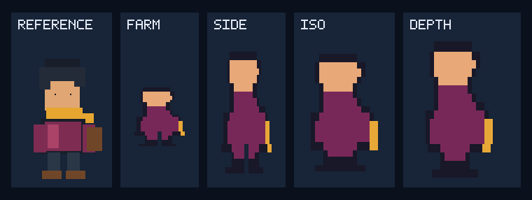

# Character reference conformance

Status: deterministic public fixture implemented; production-quality arbitrary
reference adaptation remains incomplete.

This fixture answers a narrow but important question: does the real public
pipeline read one nontrivial character image, derive one deterministic identity
signature, and place an exact representative projection into all four complete
world-pack routes?

The answer is yes for the current deterministic identity contract, and no for a
stronger claim that an arbitrary image already becomes production-quality
ImageGen art without additional provider work and human review.

## Public fixture

The fixture uses a deterministic, synthetic, CC0 `64 × 96` character with dark
hair, a gold scarf, burgundy clothing, a brown satchel, dark trousers, and warm
boots. It contains no private character, account, filename, prompt, or consumer
data.



Left to right:

1. synthetic reference;
2. `topdown-farm`;
3. `side-platformer`;
4. `isometric-action`;
5. `layered-depth-2d`.

The contact sheet deliberately shows the deterministic conformance renderer,
not the separate fixed ImageGen production candidates.

## What the command executes

```bash
pnpm character:fixture:verify
```

The verifier:

1. reconstructs the exact character and environment PNG bytes;
2. decodes the character through the same PNG decoder used by the browser path;
3. extracts one `16 × 16` silhouette, palette, anchors, and local-only SHA-256
   identity;
4. projects that identity into all four profile geometries;
5. runs all four complete world-generation and ZIP export routes;
6. opens each ZIP, locates the player atlas and animation frame through
   `mapsoo.manifest.json`, and validates the manifest's atlas byte count and
   SHA-256;
7. proves an exact representative projected frame and all four extracted
   palette roles are present in every atlas;
8. proves the ZIP excludes raw reference bytes, reference paths, reference
   digests, descriptor IDs, source filenames, and free-text description;
9. rejects undeclared fixture files and PNG text/metadata chunks;
10. compares the regenerated reference, contact sheet, evidence JSON, pack
   digests, and atlas digests with the committed fixture.

The identity digest is intentionally not serialized into a public ZIP. It is a
local correlation result used to prove that each generator received the same
extracted identity; the exact pixel comparison proves that its projection
actually reached each exported atlas.

The current fixture binds:

| Profile | Pack schema | Character clips | Player atlas |
| --- | --- | ---: | --- |
| `topdown-farm` | `0.6.0` | 8 | `atlases/character.png` |
| `side-platformer` | `0.7.0` | 12 | `atlases/character.png` |
| `isometric-action` | `0.8.0` | 128 | `atlases/player.png` |
| `layered-depth-2d` | `0.9.0` | 24 | `atlases/player.png` |

The authoritative hashes and per-profile results are in
[`evidence.json`](../tests/fixtures/character-reference-conformance/evidence.json).

## Current truth boundary

Implemented:

- PNG pixel decoding in browser and headless tests;
- browser-native JPEG decoding when the browser provides an image decoder;
- background/foreground separation;
- normalized silhouette, palette, spatial anchors, and integrity digest;
- deterministic four-profile geometry and animation projection;
- complete profile-specific ZIP generation and Godot-importable manifests;
- privacy-minimized public receipts that exclude reference bytes and local
  source paths.

Not implemented at production quality:

- semantic recognition of face, species, hairstyle, costume pieces, weapons,
  emblems, or named identity traits;
- a model provider that takes an arbitrary reference plus a confirmed style
  sample and produces every required animation consistently;
- automatic proof that model output still depicts the same person or character;
- automatic copyright, trademark, face, text, or source-image memorization
  detection;
- human approval of every pose and animation.

The polished production candidates under the ignored local art-review directory
were created from fixed ImageGen source sheets and then cut, normalized, bound,
and rendered in Godot. They prove that high-quality art can travel through the
asset engineering and runtime pipeline. They do not prove that the current
public procedural provider can reach that quality from every new reference.

The representative-frame proof also does not claim that every direction and
animation preserves semantic identity or motion continuity. That remains a
production-provider and human-review gate.

## Required production path

The next provider milestone is:

```text
owned/licensed reference
  → private identity analysis
  → confirmed world style bible
  → one character style sample
  → user confirmation
  → complete directional/animation sheet generation
  → automated frame, alpha, pivot, continuity, and role checks
  → Godot runtime render
  → human approval
  → licensed Pack 1.0 release
```

The original reference and raw prompts remain private inputs. A public pack may
contain only approved output assets, minimized provenance, license evidence,
and non-reversible identity bindings.
